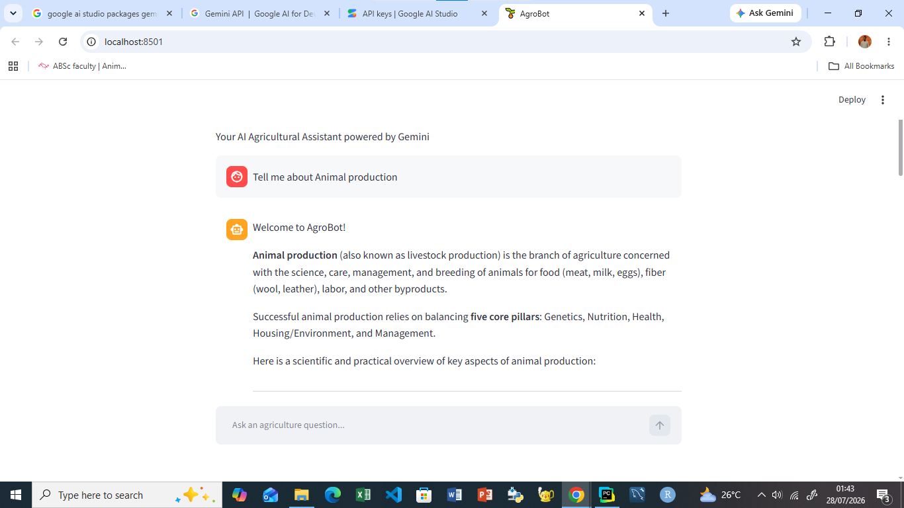

# 🌱 AgroBot: AI Agricultural Assistant

AgroBot is an intelligent agricultural chatbot powered by Google's Gemini API and built with Streamlit. 
It provides scientifically grounded, conversational assistance on a wide range of agricultural topics, 
including crop production, plant diseases, livestock management, soil health, irrigation, pest control, 
sustainable farming, and agricultural biotechnology.

Designed for farmers, students, researchers, and agricultural professionals, AgroBot delivers accurate, 
practical, and easy-to-understand responses through a modern web interface.

---

## 🚀 Features

* 🤖 AI-powered conversational assistant using Gemini
* 🌱 Expert guidance on crop production and management
* 🌿 Plant disease identification and management advice
* 🐄 Livestock production and animal health support
* 🧪 Fertilizer and nutrient recommendations
* 🌍 Soil management and soil fertility guidance
* 💧 Irrigation and water management recommendations
* 🐛 Pest and disease control strategies
* 🤖 Precision agriculture concepts and applications
* ♻️ Sustainable agriculture best practices
* 🧬 Agricultural biotechnology explanations
* 💬 Interactive chat interface built with Streamlit
* 📝 Conversation history maintained throughout each session

---

## 📷 Application Preview




---

## 🛠️ Technologies Used

* Python
* Streamlit
* Google Gemini API
* Google GenAI SDK
* python-dotenv

---

## 📁 Project Structure

```text
AgroBot/
│
├── app.py
├── .env
├── requirements.txt
├── README.md
├── images/
│   └── agrobot.png
└── .gitignore
```

---

## 📦 Installation

Clone the repository:

```bash
git clone https://github.com/yourusername/AgroBot.git
```

Move into the project folder:

```bash
cd AgroBot
```

Install the required dependencies:

```bash
pip install -r requirements.txt
```

---

## 🔑 Configure the Gemini API Key

Create a `.env` file in the project root.

```env
GEMINI_API_KEY=YOUR_API_KEY
```

You can obtain a free API key from Google AI Studio.

---

## ▶️ Running the Application

Start the Streamlit application:

```bash
streamlit run app.py
```

The application will automatically open in your web browser.

---

## 💬 Example Questions

You can ask AgroBot questions such as:

* What causes grape black rot?
* How can I prevent powdery mildew?
* Which fertilizer is suitable for maize?
* Explain precision agriculture.
* What are the symptoms of mastitis in dairy cattle?
* How do I improve soil fertility?
* What is agricultural biotechnology?
* Explain crop rotation.
* What are the advantages of drip irrigation?

---

## 🎯 Intended Users

AgroBot is designed for:

* Farmers
* Agricultural researchers
* Students
* Agricultural extension officers
* Educators
* Agronomists
* Livestock producers
* Anyone interested in agriculture

---

## 🔮 Future Improvements

Planned enhancements include:

* 📷 Plant disease detection from uploaded images
* 🧠 Integration with a custom CNN model for crop disease diagnosis
* 🌦️ Weather-aware farming recommendations
* 📍 Location-based agricultural advice
* 🌐 Multilingual support
* 🎤 Voice interaction
* 📄 Downloadable agricultural reports
* 📊 Farm analytics dashboard
* 📱 Mobile-friendly interface
* ☁️ Cloud deployment

---

## 🤝 Contributing

Contributions are welcome.

If you have ideas for new features or improvements:

1. Fork the repository.
2. Create a feature branch.
3. Commit your changes.
4. Push the branch.
5. Open a Pull Request.

---

## 📄 License

This project is licensed under the MIT License.

---

## 👨‍💻 Author

**Ometoro Emmanuel**

AI • Machine Learning • Deep Learning • Agricultural Informatics

GitHub: https://github.com/Emmaloaded7

---

## ⭐ Support

If you found this project helpful, consider giving it a ⭐ on GitHub.

Your support helps improve the project and encourages future development.
